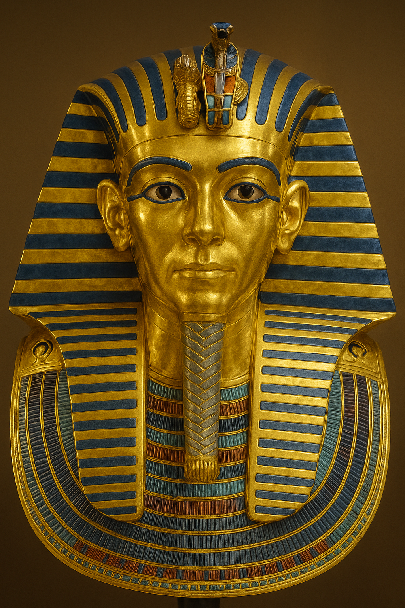
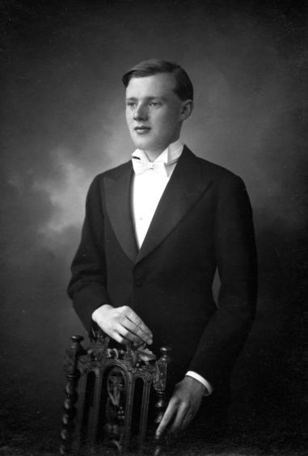
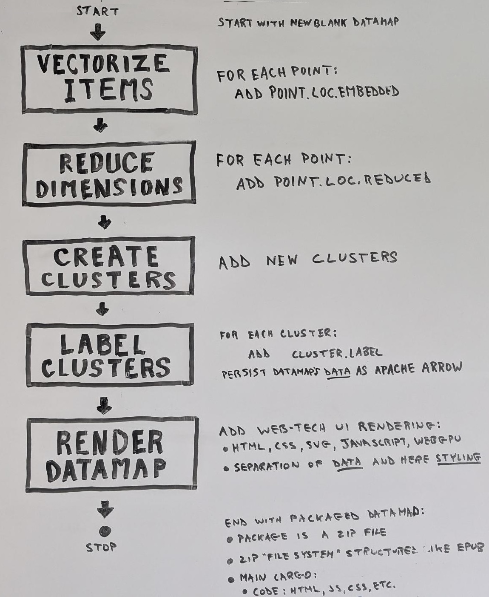

# King Tutte Scrolls

These "scrolls" (read: code and docs) are an agglomeration of
permissively licensed repos and web content for building datamaps, the
bulk of which originates out of the Tutte Institute in Canada -- hence
the nod to them in this repo's name.

Large collections of neural embedding vectors are proliferating. Each
vector database and RAG library is one at its core. Datamaps are
web-tech based, interactive visulizations of embedding vector
collections.

The goal of this King Tutte Scrolls repo is to create a one-stop shop
for those coders (both coding humans and coding daemons) wishing to
bang out datamaps of any "AI-ready data," that is, data that is or
comes with embedding vectors.

## Use cases

An AI coder LLM can immediately use this repo simply by telling the
LLM to check out [connoiter.com](https://connoiter.com). It will find
the content of this repo, the King Tutte Scrolls, transcribed to
context window-friendly markdown via the llms.txt file on
connoiter.com.

For conference workshop contexts, there are Jupyter notebooks amongst
these scrolls are designed to run on Colab. This set-up is free, has
no set-up hassles, including free GPUs, and is scalable for large
workshops. Afterwords, folks can continue to hack on their own verions
of what they were working on at the workshop, which should help
diffuse these datamap innovations.

## Tutte juxt Tut

### The Tutte Institute

<figure>
    
    <figcapture>Tutte at Cambridge</figcapture>
</figure>

[The Tutte Institute for Mathematics and Computing
(TIMC)](https://www.cse-cst.gc.ca/en/mission/research-cse/tutte-institute-mathematics-computing)
is a Canadian government funded academic institute, named after
[W. T. Tutte](https://en.wikipedia.org/wiki/W._T._Tutte). Bill Tutte
was an English and Canadian code breaker and mathematician. During
WW2, he was working alongside the likes of Alan Turing cracking the
Nazi's encrypted comms at Bletchley Park.

Notably, Tutte worked to crack the German High Command communications
code known as “Fish,” an even tougher nut to crack than the more
famous Enigma machine. Feel free to nerd out on his tools such as the Δ
and double-delta methods, wherein the cracker digitally simulates
mechanical crypto wheel based comm boxes, an en silico picking of
physical locks by tuning into (via XOR filters on bit streams) their
encrypted digital broadcasts. Bonus points, the Allies never captured
a Lorenz machine during the war. Unlike with Enigma, where they had
the machine including its code books, which proved quite handy while
reverse enginering the machine, otherwise all you'd have to go on is
the ciphertext to work it all out. :(

### King Tut

In ancient Egypt during the late Eighteenth Dynasty, King Tutankhamun,
also known as **King Tut** (not Tutte), was an Egyptian pharaoh who
ruled around 1332 to 1323 BC. King Tut has been immortalized in song
[(on YouTube)](https://www.youtube.com/embed/k-fc3UrLRLQ?autoplay=1&mute=1&loop=0).

## King Tutte Scrolls

Back to modern times: some of the folks at TIMC are high dimensional
mathemeticians, a type of scientist not a type of engineer. They have
come down out of their ivory tower and have engaged in the grubby
practice of software *engieneering* for the purpose of diffusing their
applied *science* innovations. This involved the development of
scalable algorithms (currently on the order of 10s of millions of high
dimensional data points). 

For example, tools such as UMAP and
HDBSCAN which implement provably correct algorithms (unlike, say,
LLMs). After all the numbers have been crunched, a report in order.
DataMapPlot is Python code the generate web widgets to interactively
navigate datamaps (generated by UMAP, t-SNE, etc.)

So, "King Tutte Scrolls" is just an unique, memorable name for a repos
which is essentially just a datamap toolbox, full of tools that mostly
come out of the Tutte Instutute. Packaged with lots of documentation
and sample code, it's a single git repo that a software writer can
read in order to learn how to make and tune datamaps.

# Deploying

Bonus, it would be trivial to run this repo through
[gitingest](https://github.com/coderamp-labs/gitingest) and feed the
markdown-based output to a transformer-based LLM programming
assistant, a.k.a. ka code daemon. 

With this repo in its context window, it should be able to crank out
Python code to make datamaps, which are webUI(HTML&JS&c.) widgets that
run live inside notebooks (Jupyter and Marimo) or can be exported as
    stand-along static file HTML web-apps that can be run in browsers
later.

For convenience, a pre-built run of this repo through gitingest is
available at:

https://connoiter.com/king_tutte_scrolls

Or just tell your coding LLM to check out
[connoiter.com](https://connoiter.com), and it will find the King Tutte Scrolls via the
site's llms.txt file.

## King Tutte pipelines

Multiple Tutte Institute repos|tools|softwares can be chained together in a regular datamap pipeline.

These repos can be configured together to implement –– amongst other
things –– what is herein called a King Tutte pipeline. In this repo,
these King Tutte pipeline-variants (code and Jypyter notebooks) use
multiple repositories of code out of the Tutte Institute, such as UMAP,
HDBSCAN, EVoC, DataMapPlot, Toponymy, Glasbly, and Vectorizers. Ergo
the name King Tutte.

